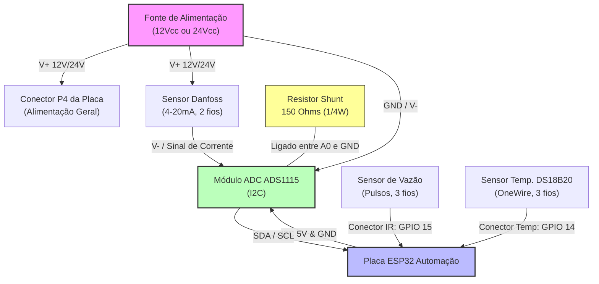

# Esquema de Ligação Elétrica: Automação do Poço

Este guia descreve as conexões elétricas necessárias para interligar os sensores (Nível, Vazão e Temperatura) e a fonte de alimentação à placa **ESP32 Automação**.

---

## 1. Diagrama de Blocos Geral (Mermaid)

O diagrama abaixo ilustra o fluxo de sinais e alimentação do sistema:



---

## 2. Pinagem Detalhada e Fiação

### 2.1. Conexão do Sensor de Nível Danfoss (4-20mA) via Módulo ADS1115

O sensor Danfoss é um transmissor passivo de 2 fios. Ele deve ser ligado em "loop" com a fonte e o conversor ADS1115.

```
       [ Fonte V+ (12V ou 24Vcc) ]
                   │
                   ▼  (Fio positivo do sensor)
         ┌───────────────────┐
         │   Sensor Danfoss  │
         │      (4-20mA)     │
         └───────────────────┘
                   │
                   ▼  (Fio de sinal / retorno)
                   │
                   ├──────────────────────────┐
                   │                          │
                 ┌─┴─┐                      ┌─┴─┐
                 │   │                      │   │
                 │ R │ Resistor             │ A │ Entrada analógica A0
                 │   │ 150 Ohms             │ 0 │ do ADS1115
                 │   │                      │   │
                 └─┬─┘                      └───┘
                   │
                   ▼
       [ GND Comum da Placa/Fonte ] <────────── GND do ADS1115
```

#### Fiação do ADS1115 para a Placa (Barramento I2C):
Conecte o módulo ADS1115 na barra de expansão I2C ou nos pinos correspondentes da placa:
* **VDD** do ADS1115 ───> **5V** da Placa
* **GND** do ADS1115 ───> **GND** da Placa
* **SCL** do ADS1115 ───> **SCL (GPIO 22)** da Placa
* **SDA** do ADS1115 ───> **SDA (GPIO 21)** da Placa
* **ADDR** do ADS1115 ──> **GND** (Garante o endereço padrão `0x48`)

---

### 2.2. Conexão do Sensor de Vazão (Pulsos)

O sensor de vazão possui 3 fios (GND, Alimentação e Sinal) e deve ser conectado no **Conector IR (GPIO 15)**:

* **Fio Preto (GND):** Conectado ao pino **GND** do conector IR.
* **Fio Vermelho (VCC):** Conectado ao pino **3.3V** ou **5V** do conector (o sensor YF-S201 funciona em ambas as tensões).
* **Fio Amarelo/Azul (Sinal/Out):** Conectado ao pino de **Dados (GPIO 15)** do conector IR.

---

### 2.3. Conexão do Sensor de Temperatura (DS18B20)

O sensor de temperatura digital deve ser conectado no **Conector TEMP/DS18B20 (GPIO 14)**:

* **Fio Preto (GND):** Conectado ao pino **GND** do conector TEMP.
* **Fio Vermelho (VCC):** Conectado ao pino **3.3V** do conector TEMP.
* **Fio Amarelo/Branco (Dados):** Conectado ao pino **DT (GPIO 14)** do conector TEMP.
  *(A placa já possui o resistor de pull-up necessário para esta porta, não precisa adicionar nenhum resistor externo aqui).*

---

### 2.4. Conexões de Comando do Painel CCM (Saídas a Relé)

* **Relé K1 (GPIO 13):** Comanda a contatora do painel para ligar a bomba.
  * Conecte o contato **Comum (C)** e **Normalmente Aberto (NA)** em série com o circuito de comando da bobina da contatora no painel CCM.
* **Relé K2 (GPIO 12):** Envia o comando de reset para o relé térmico/defeito.
  * Conecte o contato **NA** e **C** em paralelo com o botão físico de reset do painel.
